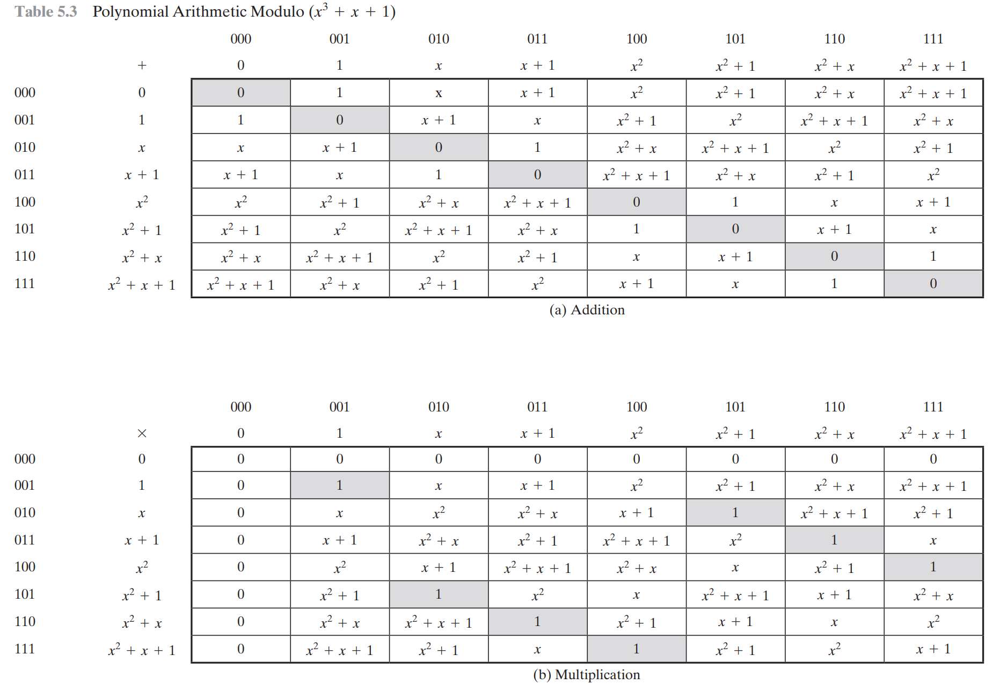

> 教材第四章 ~ 第七章第一节

## 双重 DES、三重 DES

由于算力提升，可对 DES 进行暴力破解（平均需搜索一半的密钥空间 $O(2^{55})$）。两种可行的解决办法：
1. 设计新的加密算法——AES
2. 使用双重 DES、三重 DES

> [!NOTE|label:⭐ 对双重 DES 进行「中途相遇攻击」]
假定已经明密文对 $(P,C)$, 有 $C=E_{K_2}E_{K_1}(P)$，我们只需找出 $X = E_{K_1}(P) = D_{K_2}(C)$ 即可。平均可在 $O(2^{55} \times 2) = O(2^{56})$ 内暴力破解

> [!NOTE|label:三重 DES]
> - 双倍长度密钥的 3DES：$C = E_{K_1}(D_{K_2}(E_{K_1}(P)))$，它对特定的[选择明文攻击](https://zh.wikipedia.org/wiki/%E9%80%89%E6%8B%A9%E6%98%8E%E6%96%87%E6%94%BB%E5%87%BB)和[已知明文攻击](https://zh.wikipedia.org/wiki/%E5%B7%B2%E7%9F%A5%E6%98%8E%E6%96%87%E6%94%BB%E5%87%BB)的强度较弱，NIST 认定它只有 80 位的安全性
> - 三倍长度密钥的 3DES：$C = E_{K_3}(D_{K_2}(E_{K_1}(P)))$，由于中途相遇攻击，它的有效安全性仅为 112 位
>
> 可以复用 3DES 的代码来实现 DES（当 $K_2 = K_1$ 或 $K_3 = K_2$ 时）

## 数学基础——$GF(2^n)$

> 教材第五章

- 域：域是一个集合，我们可以在其上进行加法、减法、乘法和除法而**不脱离**该集合。有理数集合、实数集合以及复数集合都是我们所熟悉的域的例子
- 有限域：含有限个元素的域，有限域在密码学中很重要

- $GF(2^n)$ 上的任何元素都表示为多项式，如 1100：$x^3 + x^2$，加法和乘法运算有多项式表示法（下图）和二进制表示法。注意，以多项式表示法运算时系数需模 2

## AES 原理

AES 轮结构由 4 个不同的阶段组成，包括一个置换和 3 个代替：
- 字节代替（Substitute Bytes）：用一个 S 盒完成分组的字节到字节的代替
- 行移位（ShiftRows）：一个简单的置换
- 列混淆（MixColumns）：利用域 $GF(2^8)$ 上的算术特性的一个代替
- 轮密钥加（AddRoundKey）：当前分组和扩展密钥的一部分进行按位 XOR

[AES](aes.mp4 ':include :type=iframe width=100% height=566px')

视频来自 https://youtu.be/mlzxpkdXP58

- AES 比 3DES 更快
- AES 不是 Feistel 结构密码，但每个阶段均可逆
- AES 加解密代码可以复用是因为存在等价逆算法，两处改进使解密算法的结构与加密算法的结构一致（教材 P128）：
  1. 交换逆向行移位和逆向字节代替：这两个操作是可以交换的，即 $逆向移行[逆向字节代替(S_i)] = 逆向字节代替[逆向移行(S_i)]$
  2. ⭐ 交换轮密钥加和逆向列混淆：对给定的状态 $S_i$，和给定的轮密钥 $w_j$，有 $逆向列混淆(S_i \oplus w_j) = [逆向列混淆(S_i)] \oplus [逆向列混淆(w_j)]$，所以要先**对轮密钥应用逆向列混淆**

<!-- 明天（7.6）看

为什么 AES 最后一轮没有列混淆？无法找到等价的解密过程

第一轮之前要轮密钥加？否则第一轮的前三个就没用-->

