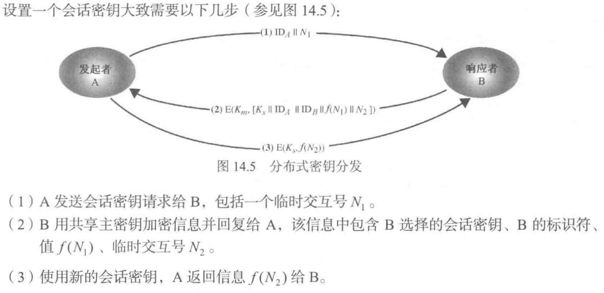

> 教材第十四章第一节、第二节，第十章

## 密钥分层

- 主密钥（Master Key）
  - 用于加密会话密钥
  - 由用户和密钥分发中心共享

- 会话密钥（Session Key）
  - 临时密钥
  - 用于用户之间的数据加密
  - 用于一次性的逻辑连接，然后丢弃

## 对称密钥的安全分发

密钥分发能通过以下方式：
1. A 选择一个密钥后以物理的方式传递给 B
2. 第三方选择密钥后物理地传递给 A 和 B
3. 分布式密钥控制：如果 A 和 B 先前或者最近使用过一个密钥，则一方可以将新密钥用旧密钥加密后发送给另一方
4. 中心化密钥控制：如果 A 和 B 到第三方 C 有加密连接，C 可以在加密连接上传送密钥给 A 和 B
5. 使用**公钥加密**来保护两者共享的密钥
6. 密钥预分发方案

3、4 使用了主密钥，3、4、5、6 需要关注

> [!WARNING]
> 课件中若涉及一些协议，我们需要关注它安不安全，若不安全如何改进

### 分布式密钥控制

- **为什么需要 $N_1$，$N_2$（Nouce，临时交互号）？**
  - 防止重放攻击。$N_1$，$N_2$ 可以是随机数，也可以是时间戳

- 这种分布式的密钥分配虽然不需要 KDC（Key Distribution Center）的参与，解决了用户分布比较广的时候密钥的分配问题。但是当网络规模很大时，每个用户所要保存的主密钥的数量也会很多

### 中心化密钥控制

#### Needham-Schroeder 协议

> 掌握基本原理及改进

(1) ~ (3) 密钥分发步骤，(3) ~ (5) 认证步骤。

**缺点**：会受到重放攻击。任何知道旧会话密钥 $K_S$ 的一方都可以重新发送消息 (3) 并计算正确的消息 (5)（假设 B 不会记录之前的会话密钥），以模拟 A 到 B

**改进 1**：Denning 协议。(2) 中加时间戳（双方时钟必须同步），$\mathrm{E}\left(K_{a},\left[K_{S}\left\|\mathrm{ID}_{B}\right\| T\left\|\mathrm{E}\left(K_{b},\left[K_{S}\left\|\mathrm{ID}_{A}\right\| T\right]\right)\right]\right)\right.$

若双方时钟不同步，当发送者的时钟快于接收者的时钟时，仍可进行重放攻击。

**改进 2**：

在 $K_S$ 的有效生命周期内，不需要 KDC 认证。

$T_b$ 所指定的时间只和 B 的时钟相关，因为只有 B 检查该时间戳，因此不要求时钟同步。

#### Kerberos 协议

> 掌握基本原理

#### 其他

教材 P310。

- 使用分层 KDC
- 一种透明密钥控制方案

### 基于公钥密码的密钥分发

公钥密码学仅限于用在密钥管理和签名这类应用中。

<!-- RSA 填充，抵抗选择密文攻击 -->

#### 简单密码分发方案

由于没有做身份识别，会受到中间人攻击：

```mermaid
stateDiagram-v2
Alice --> Darth : PU_a || ID_A
Darth --> Alice : E(PU_a, K_S)
Darth --> Bob : PU_d || ID_A
Bob --> Darth : E(PU_d, K_S)
```

#### 确保保密性和身份验证的密钥分发方案

> 假设 A 和 B 已经通过某一方案安全地交换了公钥

#### 混合方案

- 使用主密钥分发会话密钥：KDC 与每个主机共享主密钥
- 利用公钥密码分发主密钥

### 密钥预分发

双方通过预先分配的密钥材料（如：证书）建立共享的密钥，无需交换任何加密消息。**例子**：固定的 Diffie-Hellman 密钥交换算法。

- Diffie-Hellman 密钥交换的安全性建立在下述事实之上：求关于素数的模素数幂运算相对容易，而计算离散对数却非常困难
- Diffie-Hellman 不能抵抗中间人攻击

Station to Station，Shamir's no-key protocol 没看

端到端加密 VS 链接加密：https://wenku.baidu.com/view/1f1ce180ec3a87c24028c412.html