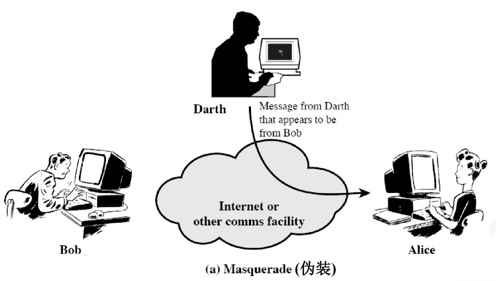
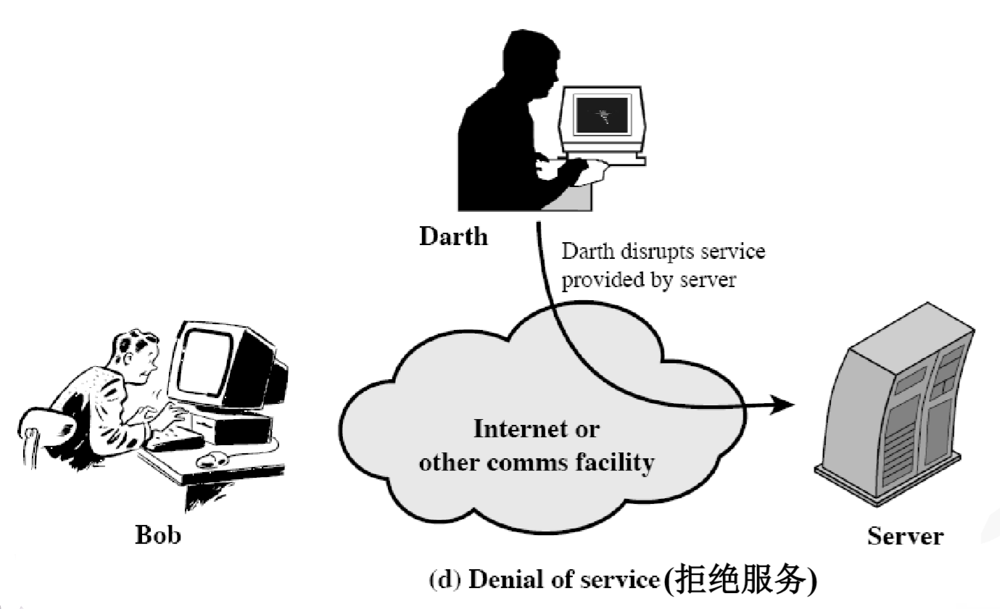
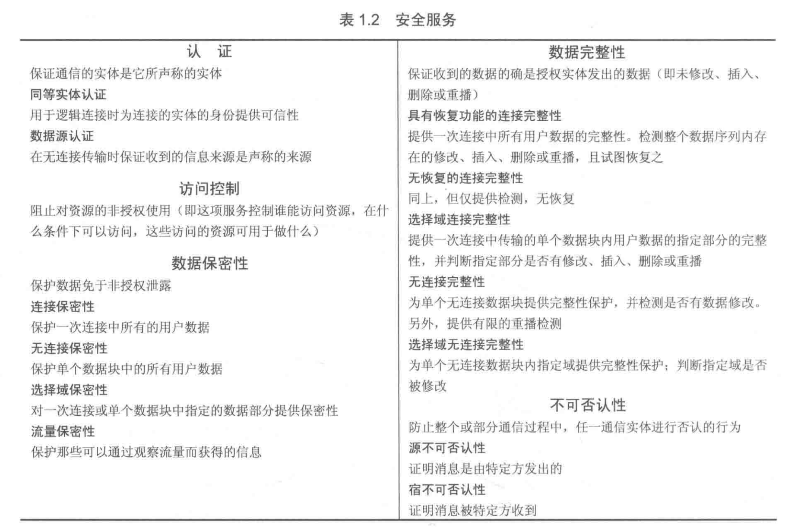
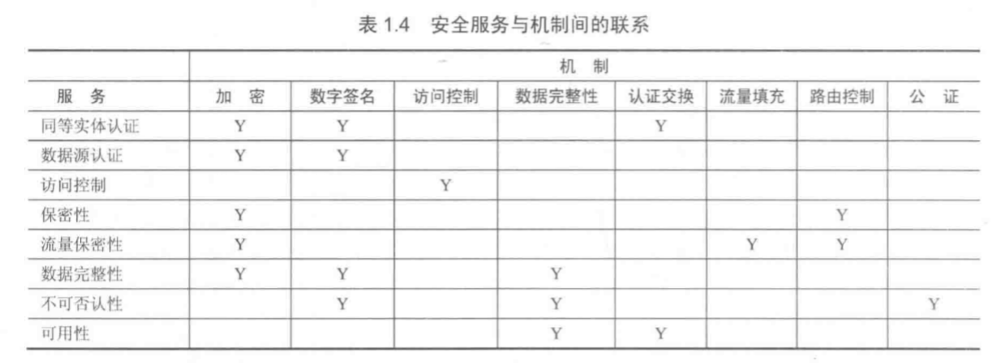

```mermaid
flowchart TB
id("密码学（CRYPTOLOGY）") --- id1("密码编码学（CRYPTOGRAPHY）")
id("密码学（CRYPTOLOGY）") --- id2("密码分析学（CRYPTANALYSIS）")
subgraph 密码学三类原语
id1.1("加密")
id1.2("哈希函数")
id1.3("数字签名")
end
id1("密码编码学（CRYPTOGRAPHY）") --- 密码学三类原语
id1.1("加密") --- id1.1.1("对称密钥加密")
id1.1("加密") --- id1.1.2("公开密钥加密")
id1.1("加密") --- id1.1.3("协议")
id1.1.1("对称密钥加密") --- id1.1.1.1("分组加密")
id1.1.1("对称密钥加密") --- id1.1.1.2("流加密")
```

> 教材第一章

OSI 安全架构主要关注安全攻击、安全服务、安全机制。

## 安全攻击

### 被动攻击

> 对于被动攻击，重点是预防而非检测

- 信息内容泄露
- 流量分析

### 主动攻击

> 主动攻击难以预防，重点在于检测并从攻击造成的破坏或延迟中恢复过来

<!-- tabs:start -->

#### ** 伪装 **

#### ** 重放 **

#### ** 信息修改 **

#### ** 拒绝服务 **

<!-- tabs:end -->

## 安全服务

**安全服务通过安全机制来实现其安全策略**。X.800 将这些服务分为 5 类共 14 个特定服务（本课对**访问控制**不做要求）：

## 安全机制

课程主要关注以下三种安全机制：
- 加密
- 数字签名：附加于数据单元之后的一种数据，它是对数据单元的密码变换，以使得（如接收方）可证明数据源和完整性，并防止伪造
- 数据完整性

## 思考题

<!-- tabs:start -->

### ** 1.1 **

> 什么是 OSI 安全架构？

OSI 安全框架是提供安全的一种组织方法，主要关注：安全攻击、安全机制和安全服务。

### ** 1.4 **

> 列出并简要定义安全服务的种类。

认证，访问控制，数据保密性，数据完整性，不可否认性。

### ** 1.5 **

> 列出并简要定义安全机制的种类。

课程主要关注加密，数字签名以及数据完整性三种特定的安全机制。

<!-- tabs:end -->