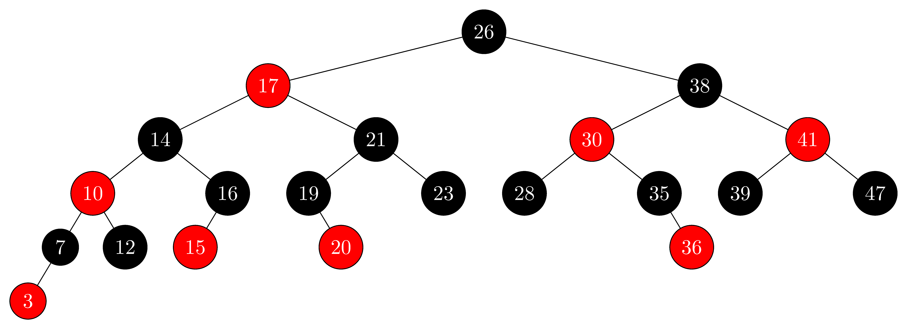
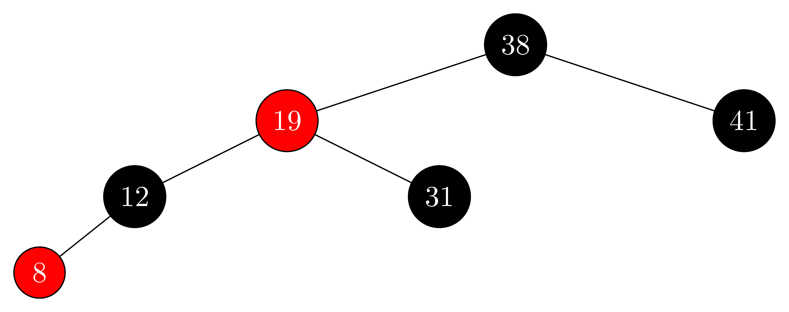

算法导论的作业答案摘自 [walkccc](https://walkccc.github.io/CLRS/)

## 红黑树相关知识

### 插入

1. 和二叉搜索树一样，把新结点 $z$ 插入到相应位置，并着红色
2. 若红结点 $z$ 的插入破坏了红黑性质，则需要进行调整，分三种情况：
   1. $z$ 的叔结点 $y$ 是红色的（case 1）
   2. $z$ 的叔结点 $y$ 是黑色的且 $z$ 是一个右孩子（case 2）
   3. $z$ 的叔结点 $y$ 是黑色的且 $z$ 是一个左孩子（case 3）

对于 case 1，经过一次调色并把 $z.p.p$ 作为新的 $z$，可变为 case 2 或 case 3；对于 case 2，把 $z.p$ 作为新的 $z$ 并经过一次左旋，变为 case 3；对于 case 3，经过一次调色和右旋后，红黑树重新保持了红黑性质

- 使红黑树保持红黑性质的过程中，旋转不会超过两次

## 13.1-2

> Draw the red-black tree that results after $\text{TREE-INSERT}$ is called on the tree in Figure 13.1 with key $36$. If the inserted node is colored red, is the resulting tree a red-black tree? What if it is colored black?
>
> 对图 13-1 中的红黑树，画出对其调用 $\text{TREE-INSERT}$ 操作插入关键字 $36$ 后的结果。如果插人的结点被标为红色，所得的树是否还是一棵红黑树？如果该结点被标为黑色呢？ 

- If the inserted node is colored red, the tree doesn't satisfy property 4 because $35$ will be the parent of $36$, which is also colored red.
- If the inserted node is colored black, the tree doesn't satisfy property 5 because there will be two paths from node $38$ to $T.nil$ which contain different numbers of black nodes.

We don't draw the _wrong_ red-black tree; however, we draw the adjusted correct tree:

## 13.1-5

> Show that the longest simple path from a node $x$ in a red-black tree to a descendant leaf has length at most twice that of the shortest simple path from node $x$ to a descendant leaf.
>
> 证明：在一棵红黑树中，从某结点 $x$ 到其后代叶结点的所有简单路径中，最长的一条至多是最短一条的 2 倍。

Suppose we have the longest simple path $(a_1, a_2, \dots, a_s)$ and the shortest simple path $(b_1, b_2, \dots, b_t)$. Then, by property 5 we know they have equal numbers of black nodes. By property 4, we know that neither contains a repeated red node. This tells us that at most $\left\lfloor \frac{s - 1}{2} \right\rfloor$ of the nodes in the longest path are red. This means that at least $\left\lceil \frac{s + 1}{2} \right\rceil$ are black, so, $t \le \left\lceil \frac{s + 1}{2} \right\rceil$. Therefore, if, by way of contradiction, we had that $s > t \cdot 2$, then $t \ge \left\lceil \frac{s + 1}{2} \right\rceil \ge \left\lceil \frac{2t + 2}{2} \right\rceil = t + 1$ results a contradiction.

## 13.2-3

> Let $a$, $b$, and $c$ be arbitrary nodes in subtrees $\alpha$, $\beta$, and $\gamma$, respectively, in the left tree of Figure 13.2. How do the depths of $a$, $b$, and $c$ change when a left rotation is performed on node $x$ in the figure?
>
> 设在图 13-2 左边一棵树中（此处有误，应为右边的树。第二版和第三版此图中两棵树左右调换了，但题目描述没改过来），$a$、$b$ 和 $c$ 分别为子树 $\alpha$、$\beta$ 和 $\gamma$ 中的任意结点。当结点 $x$ 左旋之后，$a$、$b$ 和 $c$ 的深度会如何变化？

- $a$: increase by $1$.
- $b$: unchanged.
- $c$: decrease by $1$.

## 13.3-1

> In line 16 of $\text{RB-INSERT}$, we set the color of the newly inserted node $z$ to red. Observe that if we had chosen to set $z$'s color to black, then property 4 of a red-black tree would not be violated. Why didn't we choose to set $z$'s color to black?
>
> 在 $\text{RB-INSERT}$ 的第 16 行，将新插入的结点 $z$ 着为红色。注意到，如果将 $z$ 着为黑色，则红黑树的性质 4 就不会被破坏。那么为什么不选择将 $z$ 着为黑色呢？

If we chose to set the color of $z$ to black then we would be violating property 5 of being a red-black tree. Because any path from the root to a leaf under $z$ would have one more black node than the paths to the other leaves.

## 13.3-2

> Show the red-black trees that result after successively inserting the keys $41, 38, 31, 12, 19, 8$ into an initially empty red-black tree.
>
> 将关键字 41、38、31、12、19、8 连续地插入一棵初始为空的红黑树之后，试画出该结果树。

- insert $41$:

  

- insert $38$:

  

- insert $31$:

  

- insert $12$:

  

- insert $19$:

  

- insert $8$:

  