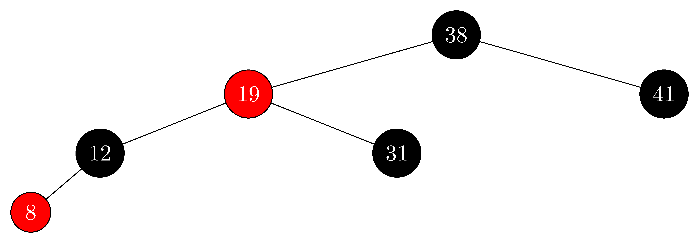
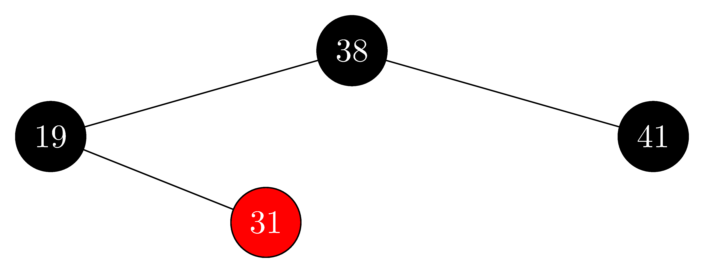

算法导论的作业答案摘自 [walkccc](https://walkccc.github.io/CLRS/)

## 13.4-6

> Professors Skelton and Baron are concerned that at the start of case 1 of $\text{RB-DELETE-FIXUP}$, the node $x.p$ might not be black. If the professors are correct, then lines 5–6 are wrong. Show that $x.p$ must be black at the start of case 1, so that the professors have nothing to worry about.
>
> Skelton 和 Baron 教授担心在 $\text{RB-DELETE-FIXUP}$ 的情况 1 开始时，结点 $x.p$ 可能不是黑色的。如果这两位教授是对的，则第 5～6 行就是错的。证明：$x.p$ 在情况 1 开始时必是黑色的，从而说明这两位教授没有担心的必要。


At the start of case 1 we have set $w$ to be the sibling of $x$. We check on line 4 that $w.color == red$, which means that the parent of $x$ and $w$ cannot be red. Otherwise property 4 is violated. Thus, their concerns are unfounded.

## 14.1-3

> Write a nonrecursive version of $\text{OS-SELECT}$.
>
> 写出 $\text{OS-SELECT}$ 的非递归版本。

```cpp
OS-SELECT(x, i)
    r = x.left.size + 1
    while r != i
        if i < r
            x = x.left
        else x = x.right
            i = i - r
        r = x.left.size + 1
    return x
```

## 14.2-2

> Can we maintain the black-heights of nodes in a red-black tree as attributes in the nodes of the tree without affecting the asymptotic performance of any of the redblack tree operations? Show how, or argue why not. How about maintaining the depths of nodes?
>
> 能否在不影响红黑树任何操作的渐近性能的前提下，将结点的黑高作为树中结点的一个属性来维护？说明如何做，如果不能，请说明理由。如何维护结点的深度？


Since the black height of a node depends only on the black height and color of its children, Theorem 14.1 implies that we can maintain the attribute without affecting the asymptotic performance of the other red-black tree operations. The same is not true for maintaining the depths of nodes. If we delete the root of a tree we could potentially have to update the depths of $O(n)$ nodes, making the $\text{DELETE}$ operation asymptotically slower than before.

<br>
<details>
<summary style="font-size: 17px;font-weight: 600;"><span style="color: red;cursor: pointer;">红黑树的删除<span></summary>
<br>

> [!NOTE]
> 此题不是作业题

## 13.4-3

> In Exercise 13.3-2, you found the red-black tree that results from successively inserting the keys $41, 38, 31, 12, 19, 8$ into an initially empty tree. Now show the red-black trees that result from the successive deletion of the keys in the order $8, 12, 19, 31, 38, 41$.
>
> 在练习 13.3-2 中， 将关键字 $41、38、 31、12、19、8$ 连续插入一棵初始的空树中，从而得到一棵红黑树。请给出从该树中连续删除关键字 $8、12、19、31、38、41$ 后的红黑树。

- initial:



- delete $8$:


- delete $12$:



- delete $19$:


- delete $31$:


- delete $38$:


- delete $41$:


</details>
<br>

> [!WARNING]
> 第二版中的 [14.2-3](https://cdn.jsdelivr.net/gh/JingqingLin/ImageHosting@master/img/20200515170540.png) 在第三版中已合并到 14.2-2

<style>
.image-delete-41 {
  width: 12%
}

.image-delete-38 {
  width: 12%
}

.image-delete-31 {
  width: 45%
}
</style>