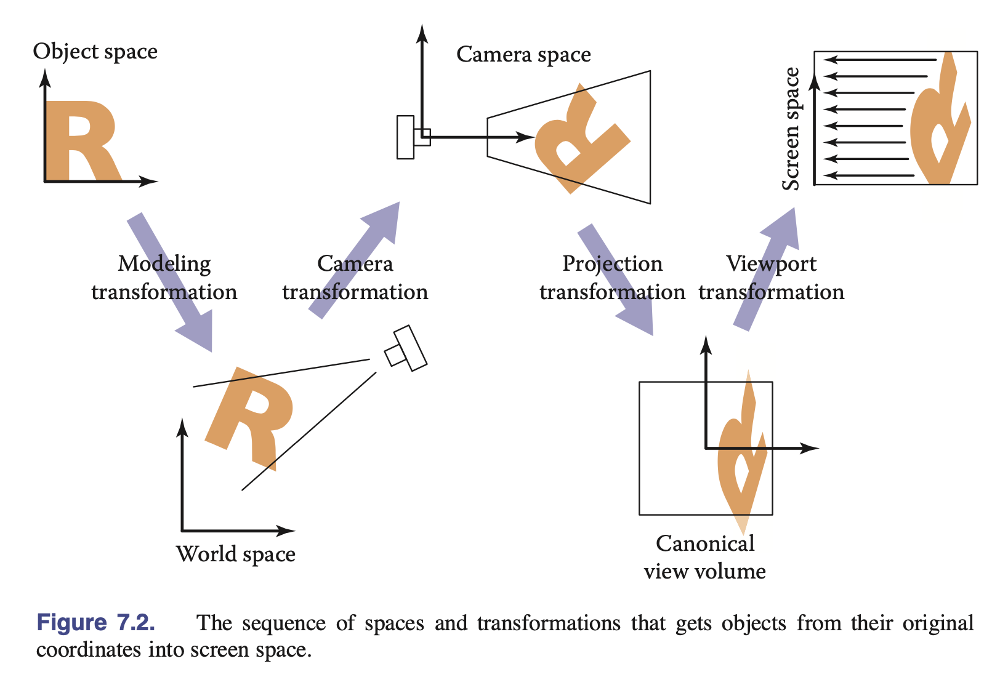

- 二维变换
- 齐次坐标
- 组合变换
- 三维变换
- 观测（Viewing）变换

## 二维变换

使用矩阵表示表换。

- 线性变换：旋转，缩放，切变  
  $\left[\begin{array}{l}x^{\prime} \\ y^{\prime}\end{array}\right]=\left[\begin{array}{ll}a & b \\ c & d\end{array}\right]\left[\begin{array}{l}x \\ y\end{array}\right]$
- 仿射变换：线性变换**接上**平移  
  $\left[\begin{array}{l}x^{\prime} \\ y^{\prime}\end{array}\right]=\left[\begin{array}{ll}a & b \\ c & d\end{array}\right]\left[\begin{array}{l}x \\ y\end{array}\right]+\left[\begin{array}{l}t_{x} \\ t_{y}\end{array}\right]$

## 齐次坐标

平移不能以矩阵连乘的形式表示，因此引入齐次坐标（用 $N + 1$ 维来代表 $N$ 维坐标）：增加第三个轴（$w$ 轴）
- 二维点：$(x, y, 1)^{\mathsf{T}}$
- 二维向量：$(x, y, 0)^{\mathsf{T}}$

$\left[\begin{array}{l}x^{\prime} \\ y^{\prime} \\ w^{\prime}\end{array}\right]=\left[\begin{array}{ccc}1 & 0 & t_{x} \\ 0 & 1 & t_{y} \\ 0 & 0 & 1\end{array}\right] \cdot\left[\begin{array}{l}x \\ y \\ 1\end{array}\right]=\left[\begin{array}{c}x+t_{x} \\ y+t_{y} \\ 1\end{array}\right]$

这样平移也可以用矩阵相乘的方式表示。

- 向量和点为什么在 $w$ 轴上有区别？
  - 向量具有平移不变性，经上述矩阵相乘后结果不变
  - 
    - 向量 + 向量 = 向量
    - 点 - 点 = 向量
    - 点 + 向量 = 点
    - 点 + 点 = 两个点的中点

## 组合变换

$A_{n}\left(\ldots A_{2}\left(A_{1}(\mathbf{x})\right)\right)=\mathbf{A}_{n} \cdots \mathbf{A}_{2} \cdot \mathbf{A}_{1} \cdot\left[\begin{array}{l}x \\ y \\ 1\end{array}\right]$

## 三维变换

- 旋转的表示：欧拉角、四元数
- 罗德里格斯旋转公式

## 观测变换（Viewing Transformation）

> [!TIP|label:Think about how to take a photo]
> - Find a good place and arrange people (model transformation)
> - Find a good "angle" to put the camera (view transformation)
> - Cheese! (projection transformation)

### 视图/相机变换

定义相机：
- Position $\vec{e}$
- Look-at direction $\hat{g}$
- Up direction $\hat{t}$

一般约定把相机放在“标准位置”上——The origin, up at Y, look at -Z，所以需要把相机变换到标准位置上（物体也跟着变换）。课件 P15 & 16

### 投影变换

- 正交投影
- 透视投影：可分为两步
  - “挤压”平截头体，让其成为一个长方体或者立方体
  - 对长方体进行正射投影

透视投影比较难理解，看[这篇](https://zhuanlan.zhihu.com/p/152280876)

## 补充

- 旋转变换矩阵的逆矩阵和转置矩阵相等（称为正交矩阵）

$R_{\theta}=\left(\begin{array}{cc}\cos \theta & -\sin \theta \\ \sin \theta & \cos \theta\end{array}\right)$

$R_{-\theta}=\left(\begin{array}{cc}\cos \theta & \sin \theta \\ -\sin \theta & \cos \theta\end{array}\right)=R_{\theta}^{\top}$