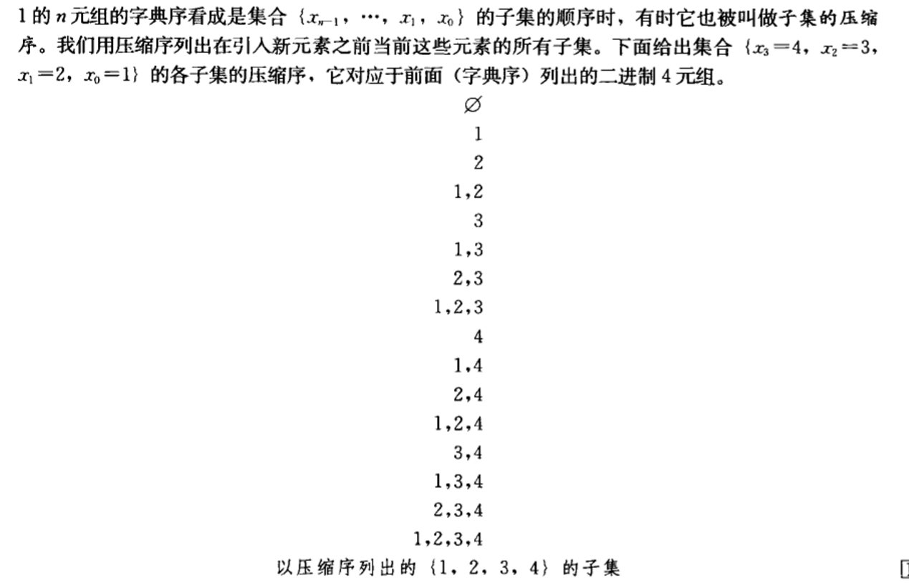

## 知识回顾

\- 问：哪些题目可用用深搜或广搜？

\- 答：图或树的遍历

### BFS
实现 BFS 时需要考虑以下问题：
- 队列：用来存储每一轮遍历得到的节点；
- 标记：对于遍历过的节点，应该将它标记，防止重复遍历。

```java
void BFS()
{
    定义队列;
    定义备忘录，用于记录已经访问的位置；

    判断边界条件，是否能直接返回结果的。

    将起始位置加入到队列中，同时更新备忘录。

    while (队列不为空) {
        获取当前队列中的元素个数。
        for (元素个数) {
            取出队头节点。
            判断是否到达终点。
            获取它对应的下一个所有的节点，过滤不符合条件的位置。
            新位置插入队尾。
            更新备忘录。
        }
    }

}
```

### DFS
实现 DFS 时需要考虑以下问题：
- 栈：用栈来保存当前节点信息，当遍历新节点返回时能够继续遍历当前节点。可以使用**递归**栈；
- 标记：和 BFS 一样同样需要对已经遍历过的节点进行标记。

### 回溯
Backtracking（回溯）属于 DFS。  
- 普通 DFS 主要用在**可达性问题** ，这种问题只需要执行到特点的位置然后返回即可。
- 而 Backtracking 主要用于求解**排列组合**问题，例如有 { 'a','b','c' } 三个字符，求解所有由这三个字符排列得到的字符串，这种问题在执行到特定的位置返回之后还会继续执行求解过程。

因为 Backtracking 不是立即返回，而要继续求解，因此在程序实现时，需要注意对元素的标记问题：  
- 在访问一个新元素进入新的递归调用时，需要将新元素标记为已经访问，这样才能在继续递归调用时不用重复访问该元素；
- 但是在递归返回时，需要将元素**标记为未访问**，因为只需要保证在一个递归链中不同时访问一个元素，可以访问已经访问过但是不在当前递归链中的元素。

---
## BFS
### 1. 二进制矩阵中的最短路径

!> [1091](https://leetcode-cn.com/problems/shortest-path-in-binary-matrix/). 二进制矩阵中的最短路径

还不会写 BFS 代码，参考了题解

**测试用例：**
- [[0]]  
- 起始点即为阻塞路：[[1, 0, 0], [1, 1, 0], [1, 1, 0]]  

**注意点：**  
- 遍历各个方向的先后顺序影响运行速度。一般是先右再左
    ```java
    int[][] direction = {{1, 0}, {1, 1}, {1, -1}, {0, 1}, {0, -1}, {-1, 0}, {-1, -1}, {-1, 1}};
    ```
- ⭐ 标记位置的选择很重要。某个点插入队列后应立即标为 1，如下代码：

    

    否则，搜索到某层时，会把同一层的兄弟节点作为下一层节点。如下图，遍历到第二层，红框内的两个 $0$ 都会把对方作为下一层节点放入队列。

    

    因此，可能会出现这种无意义的路径，导致队列太大，运行时堆内存溢出

     

### 2. 完全平方数

!> [279](https://leetcode-cn.com/problems/perfect-squares/comments/). 完全平方数

#### BFS
*如果不是放在“搜索”专题里，很难想到 BFS*  
最好不要用 `sqrt()` （每个循环里都使用这个方法，速度很慢），而是一次性生成小于等于 $n$ 的平方数（每个循环里仅需判断大小）。
#### 数学定理
1. 任何正整数都可以拆分成不超过 4 个数的平方和 --> 答案只可能是 1, 2, 3, 4
2. 如果一个数最少可以拆成4个数的平方和，则这个数还满足 $n = (4^a)*(8b+7)$ --> 因此可以先看这个数是否满足上述公式，如果不满足，答案就是 1, 2, 3 了
3. 如果这个数本来就是某个数的平方，那么答案就是 1，否则答案就只剩 2, 3 了
4. 如果答案是 2，即 $n=a^2+b^2$，那么我们可以枚举 $a$，来验证，如果验证通过则答案是 2
5. 只能是 3

#### 动态规划

记录在[动态规划.md](leetcode/algorithm/动态规划?id=_2-完全平方数) 中

## DFS
### 1. 单词接龙

!> [127](https://leetcode-cn.com/problems/word-ladder/). 单词接龙

- 如何对 `List` 中已加入队列的单词做标记？  
直接删除即可

```java
Iterator<String> it = wordList.iterator();
while (it.hasNext()) {
    String word = it.next();
    if (...) {
        it.remove();
    }
}
```

- 判断字符串是否相等时，一开始使用了 `==`，并在 Intellij IDEA 和力扣的 Playground 里测试通过，但在力扣的控制台无法通过。应当使用 `equals()`。  
    1. 基类 `Object` 类具有 `equals()` 方法，其初始行为是**地址**比较，但在一些类如 `String, Integer, Date` 中被重写为**值**比较。  
    2. 八大数据类型中数据变量中直接存储值，所以 `==` 为**值**比较。而在引用类型中，`==` 为**地址**比较。  

#### 双端BFS  
[论坛题解](https://leetcode-cn.com/problems/word-ladder/solution/shuang-duan-yan-du-you-xian-di-gui-yu-chu-li-44ms-/)

---

## 回溯
### 1. 岛屿的最大面积

!> [695](https://leetcode-cn.com/problems/max-area-of-island/). 岛屿的最大面积

递归或迭代实现 **DFS** 都可，代码还不太熟练，参考了[题解](https://leetcode-cn.com/problems/max-area-of-island/solution/dao-yu-de-zui-da-mian-ji-by-leetcode/)

### 2. ⭐ 朋友圈

!> [547](https://leetcode-cn.com/problems/friend-circles/). 朋友圈

以邻接矩阵表示朋友关系，即 $N * N$ 的对称矩阵。与上题代码写法略不相同。代码还不太熟练。
#### DFS & BFS & 并查集
[官方题解](https://leetcode-cn.com/problems/friend-circles/solution/peng-you-quan-by-leetcode/)  
**并查集**解法看代码和注释

### 3. 太平洋大西洋水流问题

!> [417](https://leetcode-cn.com/problems/pacific-atlantic-water-flow/). 太平洋大西洋水流问题

注意审题，“太平洋”和“大西洋”，并不在一个点上，如下图：


`~` 代表太平洋海域；`*` 代表大西洋海域。  
因此左和上边都可以直接抵达太平洋，同理右和下边也可直接抵达大西洋。所以，从左和上边上的点出发，判断其余点能否到达太平洋（逆流判断）；从右和下边上的点出发，判断其余点能否到达大西洋

---

### 4. 电话号码的字母组合

!> [17](https://leetcode-cn.com/problems/letter-combinations-of-a-phone-number/). 电话号码的字母组合

#### 回溯
- 如何确认已经进行到第几个数字键？ - 根据 `prefix` 的长度确认。  
- 需要考虑如何返回最后的结果。

不熟练

### 5. ⭐ 复原IP地址

!> [93](https://leetcode-cn.com/problems/restore-ip-addresses/). 复原IP地址

#### 👍 暴力解法

https://leetcode-cn.com/problems/restore-ip-addresses/solution/ke-neng-shi-zui-you-mei-de-bao-li-jie-fa-liao-by-u/

自己使用了回溯，思路是比较简单的，但是对一些条件的判断想了挺久。  
比如：对于 `1111` 进行到 `111.1` 后如何停止； 对于 `2552552552` 进行到 `25.52.55.25` 后如何不输出

### 6. ❓ 单词搜索

!> [79](https://leetcode-cn.com/problems/word-search/). 单词搜索

力扣控制台结果输出正确，但提交时是错的。  
[力扣](https://support.leetcode-cn.com/hc/kb/article/1194344/)给出了解释：全局变量应该在方法内手动初始化

### 7. 二叉树的所有路径

!> [257](https://leetcode-cn.com/problems/binary-tree-paths/description). 二叉树的所有路径

**注意点：**

Java 的引用类型都是引用传递。`StringBuilder` 的字符串拼接、删除等操作是原地进行的，因此深一层的递归对 `StringBuilder` 类型的字符串进行修改后，退出递归时要还原。  
而 `String` 类是不可变的，因此 `String` 的拼接操作需要赋给一个指向新的内存地址的变量。如 `path = path + "->"` 或 `path = path.concat("->")` 。因此，传入下一层的字符串已经指向不同的地址，退出递归时不用还原。  
所以下方左子树递归返回后，要使 `path` 变为递归之前的内容  

```java
private static void dfs(List<String> pathList,StringBuilder path, TreeNode root) {
    ...
    int pathLen = path.length();
    dfs(pathList, path, root.left);
    path.delete(pathLen, path.length());
    ...
}
```

### 8. 全排列 I & II
#### 给定序列不包含重复数字

!> [46](https://leetcode-cn.com/problems/permutations/). 全排列

**插入法生成全排列**：（组合数学）


#### 可包含重复数字

!> [47](https://leetcode-cn.com/problems/permutations-ii). 全排列 II

同样也用**插入法**，但是插入方式为

①〇〇 -> ①②〇 -> ①②③  
①〇〇 -> ①③〇 -> ①③②  
①〇〇 -> ...

**判重**：在添加一个元素时，判断这个元素是否等于前一个元素，如果等于，并且*前一个元素还未访问*，那么就跳过这个元素。

***当前元素与前一个元素相等（设值为 `a`），且前一个元素还未访问***：因为退出递归时 `visited[i] = false`。所以这个判定条件表示，在这个位置上，以数值 `a` 开头的排列前一个元素（也是 `a`）已经排过了，所以跳过。

### 9. 组合系列

!> [77](https://leetcode-cn.com/problems/combinations/). 组合 && [39](https://leetcode-cn.com/problems/combination-sum/). 组合总和 I && [40](https://leetcode-cn.com/problems/combination-sum-ii/). 组合总和 II && [216](https://leetcode-cn.com/problems/combination-sum-iii/). 组合总和 III

#### 回溯 + 剪枝
**见代码及注释**。“组合总和 II”的去重思路和上一题“全排列 II”相似

### 10. 子集

!> [78](https://leetcode-cn.com/problems/subsets/). 子集

**压缩序**列出子集：



截图来自组合数学。压缩序要对子集反复读取，较费时间。

⭐ **二进制**方法：

https://leetcode-cn.com/problems/subsets/solution/er-jin-zhi-wei-zhu-ge-mei-ju-dfssan-chong-si-lu-9c/


我们假设 `nums[] = {1, 2, 3, 4}`，则 0011 的第 1、2 位为 1 ，代表选取 `nums` 中的 1、2 位作为一个子集，子集为 `[1, 2]`；若 `nums[] = {2, 3, 4, 5}`，则子集为 `[2, 3]`

### 11. 解数独

!> [37](https://leetcode-cn.com/problems/sudoku-solver/). 解数独

> 解数独的难点在于如何判定**只出现一次**这个条件

```java
private static boolean[][] rowsUsed = new boolean[9][10];
private static boolean[][] colsUsed = new boolean[9][10];
private static boolean[][] cubesUsed = new boolean[9][10];
```
`rowsUsed[i][j]` 表示第 $i$ 行是否已填好数字 $j$  

### 12. 💣 N 皇后

!> [51](https://leetcode-cn.com/problems/n-queens/). N皇后

> N 皇后的难点在于斜线上是否已存在皇后

自己的思路：遍历左上和右上两个方向，判断是否已存在皇后

**更好的方法**：$n * n$ 的矩阵中，正副对角线各有 $2n-1$ 条，若某点摆上皇后，则把这个点所属的正副对角线设为已使用

转换关系如下：

```java
topLeftIndex = column + n - 1 - row
topRightIndex = column + row
```